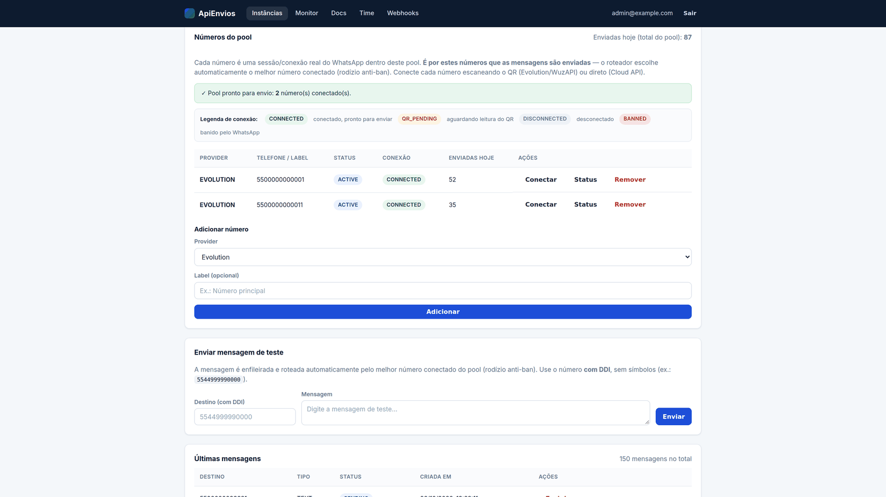
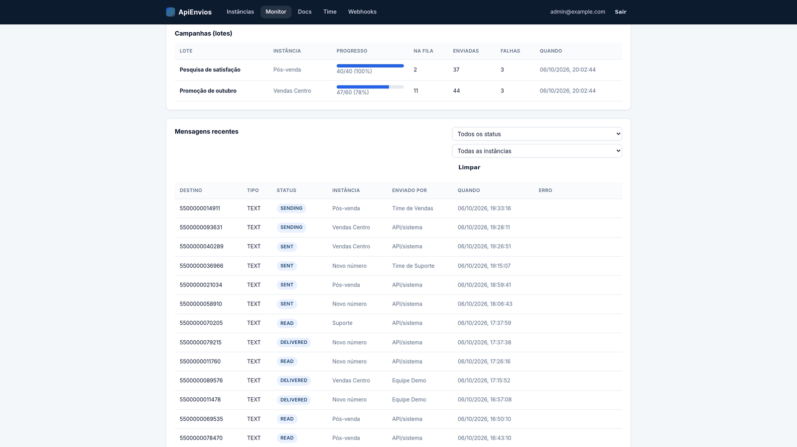
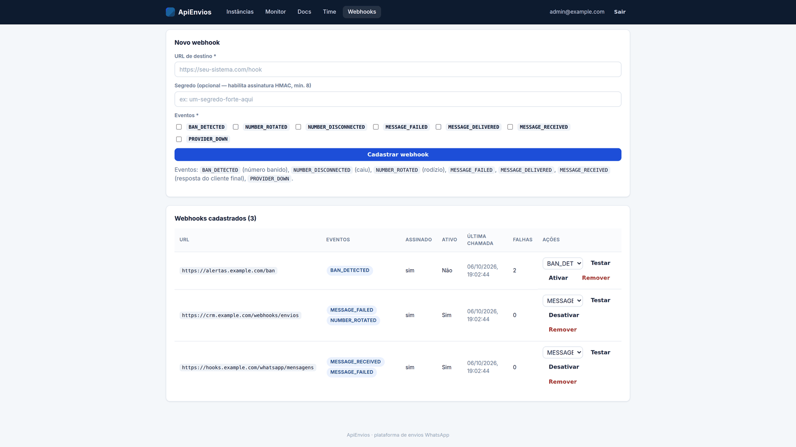
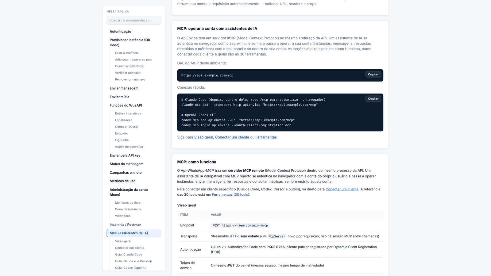
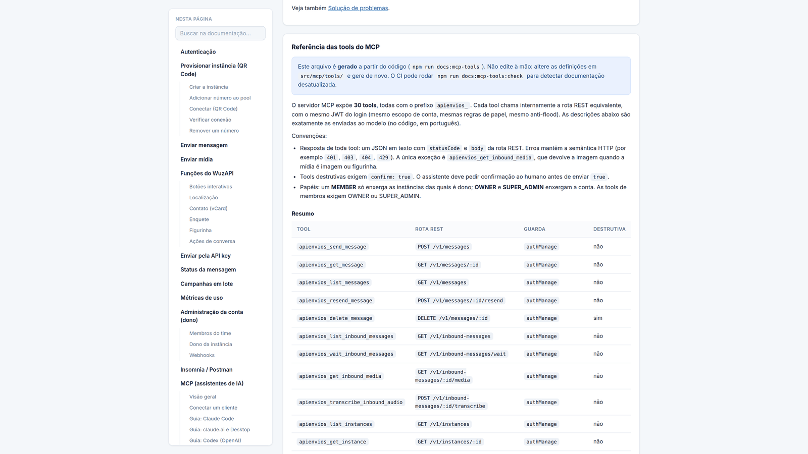

# Api-WhatsApp-MCP (ApiEnvios)

Plataforma de envio de WhatsApp **multi-tenant** e de código aberto, com **pool de números por
instância**, **fallback opcional entre três provedores**, proteção anti-ban e anti-flood,
painel web de administração, API REST e um **servidor MCP remoto** (OAuth 2.1) para que
assistentes de IA, como o Claude, gerenciem a conta e até conversem pelo WhatsApp.

Stack: Node 20+ · TypeScript · Fastify 5 · Prisma 5 (PostgreSQL 16) · Redis 7 + BullMQ ·
Zod · Pino · Eta + Alpine.js (painel) · Vitest · Docker.

> Status: `0.1.0`, extraído de um sistema em produção. As APIs ainda podem mudar antes da `1.0`.

## Arquitetura

```
Conta (ApiClient / tenant)
  ├── Usuários (OWNER / MEMBER)         ── login com JWT (painel / API)
  └── Instâncias                        ── uma "instância" = um POOL de números
        └── Números (InstanceNumber)    ── cada número = uma sessão real em um provedor
              ├── 1. Evolution API   (texto/mídia, principal)
              ├── 2. WuzAPI          (texto/mídia + botões, localização, contato, enquetes, listas)
              └── 3. WhatsApp Cloud  (oficial, fallback pago)
```

Você envia para uma **instância** e o roteador escolhe o melhor número **CONNECTED**
(rodízio anti-ban), preferindo um número **WuzAPI** quando o conteúdo exige recursos ricos
(botões / localização / contato / enquete / lista). Evolution e Cloud API não suportam esses
tipos e falham de forma explícita (nunca degradam em silêncio para texto). Quando um ban é
detectado, o número passa para `BANNED` e um webhook é disparado.

## Autenticação e papéis

| Autenticação | Cabeçalho | Uso |
|---|---|---|
| **Token da instância** | `Token: <token>` | Aplicações cliente que enviam por uma instância específica |
| **API key da conta** | `x-api-key: <chave>` | Gerenciamento de várias instâncias (a instância vai no corpo) |
| **JWT (login humano)** | `Authorization: Bearer <jwt>` ou cookie do painel | Pessoas (painel / API / MCP), com um papel |

| Recurso | MEMBER | OWNER (dono da conta) | Super admin |
|---|:---:|:---:|:---:|
| Enviar / campanhas / status | sim (instâncias próprias) | sim (conta) | sim (global) |
| Ver instâncias | só as **suas** (`ownerUserId`) | todas da conta | todas |
| Métricas | suas instâncias | conta | conta |
| Criar / editar / apagar instância | próprias | conta | qualquer |
| Atribuir dono de instância | não | sim | sim |
| Gerenciar membros (`/v1/account/users`) | não | sim (somente MEMBER) | sim |
| Webhooks da conta | — | sim | sim |
| Admin: contas / usuários / instâncias globais (`/v1/admin/*`) | não | não | sim |

## Início rápido

### Com Docker Compose

```bash
git clone https://github.com/Otavio1661/Api-WhatsApp-MCP.git && cd Api-WhatsApp-MCP
cp .env.example .env
# Preencha API_SECRET, JWT_SECRET, SECRETS_ENCRYPTION_KEY (openssl rand -base64 32)
# e POSTGRES_PASSWORD (openssl rand -hex 24)
docker compose -f docker-compose.example.yml up -d --build
```

A API e o painel respondem em `http://localhost:3000` (painel em `/admin`).
Crie o primeiro administrador definindo `ADMIN_SEED_EMAIL` / `ADMIN_SEED_PASSWORD` e
rodando `npm run db:seed` a partir de um checkout apontado para o mesmo banco (a imagem de
produção não traz as ferramentas de desenvolvimento). Veja [docs/self-hosting.md](docs/self-hosting.md).

### Desenvolvimento local

```bash
npm install
cp .env.example .env                 # DATABASE_URL, REDIS_*, JWT_SECRET, API_SECRET, SECRETS_ENCRYPTION_KEY...
docker compose -f docker-compose.example.yml up -d postgres redis
npx prisma migrate deploy && npx prisma generate
npm run db:seed                      # SOMENTE DEV: dados fictícios de demonstração (veja prisma/seed.ts)
npm run dev
```

## Painel web (`/admin`)

Login com JWT (cookie httpOnly). Telas por papel: **Instâncias** (status derivado do
pool), **Monitor** (campanhas e mensagens), **Webhooks**, **Docs** (referência da API filtrada
por papel, com a seção **MCP** para conectar assistentes de IA), **Equipe** (OWNER: membros e
donos de instâncias) e **Administração** (super admin: contas e usuários).

### Capturas de tela

Pool de números de uma instância, com o status de cada conexão:



Monitor de campanhas (lotes) e mensagens recentes:



Cadastro e acompanhamento de webhooks:



Página Docs, seção MCP: URL do ambiente e comandos de conexão (Claude Code e Codex):



Referência das 30 ferramentas do MCP, gerada a partir do código:



> Capturas de uma instância de demonstração com dados fictícios e um provedor simulado;
> os status de conexão e os números são de exemplo, não representam uso real.

## API REST (resumo)

```
POST /v1/instance/:id/messages/chat     { to, body }
POST /v1/instance/:id/messages/media    { to, type, mediaUrl, caption }
POST /v1/messages                       { to, type, text|mediaUrl, instanceId?, scheduledAt? }
POST /v1/campaigns                      { to:[...], text|mediaUrl, instanceId?, externalIdPrefix? }
GET  /v1/messages/:id                   status da mensagem
GET  /v1/messages?status=&page=&limit=  histórico
GET/POST/PATCH/DELETE /v1/instances[/:id]   (+ /connect, /qr, /status, /numbers ...)
GET  /v1/metrics?days=30
POST /v1/webhooks                       { url, events[], secret? }
GET/POST/PATCH/DELETE /v1/account/users (OWNER) gerencia MEMBERs
GET/POST/PATCH/DELETE /v1/admin/...     (super admin) contas, usuários, instâncias globais
GET  /health                            { status, version, uptimeSec, checks:{database,redis} }
```

O painel serve a referência completa, filtrada por papel, em `/admin/docs`.

## Webhooks

Eventos: `BAN_DETECTED`, `NUMBER_DISCONNECTED`, `NUMBER_ROTATED`, `MESSAGE_FAILED`,
`MESSAGE_DELIVERED`, `PROVIDER_DOWN`. A entrega é assíncrona, com retry e backoff
(BullMQ). Com um `secret`, todo POST leva:

```
X-ApiEnvios-Event:     <evento>
X-ApiEnvios-Timestamp: <epoch em ms>
X-ApiEnvios-Signature: sha256=<HMAC-SHA256 de "<timestamp>.<corpo>">
```

Valide recalculando o HMAC sobre `${timestamp}.${rawBody}` com o seu secret.
As URLs de webhook passam por uma verificação anti-SSRF (endereços privados, de loopback e
de metadados de nuvem são rejeitados).

## Anti-ban e anti-flood

- Espaçamento de envio por instância (lock no Redis + atraso aleatório).
- Limite por destinatário por hora, por conta (`ApiClient.maxPerRecipientPerHour`, `0` = sem limite);
  ao excedê-lo, a API devolve `429 Retry-After` sem enfileirar.
- Aquecimento de números novos, rotação automática em caso de ban e limite diário por número.

## Servidor MCP (assistentes de IA)

`POST /mcp` expõe **30 tools** (instâncias, mensagens, mensagens recebidas, campanhas,
webhooks, membros, métricas) via Streamable HTTP (stateless) com **OAuth 2.1 + PKCE** e
Dynamic Client Registration. Cada tool chama a rota REST normal com o JWT do usuário
logado, então o isolamento por tenant, a checagem de papéis e o anti-flood valem exatamente
como na API. Uma **ponte opcional WhatsApp <-> assistente** permite que um assistente
conectado responda mensagens em seu nome (totalmente configurável).

Início rápido (troque a URL pela URL HTTPS pública da sua API):

```bash
# Claude Code
claude mcp add --transport http apienvios https://api.example.com/mcp   # depois rode /mcp para fazer login

# OpenAI Codex CLI
codex mcp add apienvios --url https://api.example.com/mcp
codex mcp login apienvios --oauth-client-registration dcr
```

| Cliente | Situação do guia de conexão |
|---|---|
| [Claude Code](docs/mcp/clients/claude-code.md) | Verificado na documentação do fabricante |
| [claude.ai / Claude Desktop](docs/mcp/clients/claude-ai-desktop.md) | Verificado na documentação do fabricante |
| [OpenAI Codex](docs/mcp/clients/codex.md) | Verificado na documentação do fabricante |
| [Cursor](docs/mcp/clients/cursor.md) | Verificado; o fabricante diz que DCR não é suportado, contorno não testado |
| [Windsurf](docs/mcp/clients/windsurf.md), [Gemini CLI](docs/mcp/clients/gemini-cli.md), [Zed](docs/mcp/clients/zed.md) | Verificado na documentação do fabricante |
| [ChatGPT](docs/mcp/clients/chatgpt.md), [VS Code](docs/mcp/clients/vscode.md), [Cline](docs/mcp/clients/cline.md), [Continue](docs/mcp/clients/continue.md) | Parcial (alguns pontos não confirmados) |
| [Qualquer cliente só com stdio](docs/mcp/clients/mcp-remote.md) | Pela ponte `mcp-remote` |

Documentação completa: [como funciona](docs/mcp/overview.md),
[conectar um cliente](docs/mcp/connect.md), [referência das tools](docs/mcp-tools.md),
[segurança](docs/mcp/security.md), [solução de problemas](docs/mcp/troubleshooting.md) e
[exemplos](docs/mcp/examples.md).

## Segredos criptografados em repouso

`Instance.token`, `Instance.webhookSecret` e `ApiClient.apiKey` são credenciais ativas que
precisam ser exibidas em texto claro no painel/API após a criação, por isso são protegidas
com criptografia simétrica reversível (AES-256-GCM) em vez de hash:

- Implementação em `src/utils/secrets-crypto.ts`: IV aleatório por valor, armazenado como
  `iv:tag:ciphertext` (base64). A chave mestra vem de `SECRETS_ENCRYPTION_KEY`
  (`openssl rand -base64 32`), nunca do schema, das migrations nem do git.
- Um **blind index** (`tokenHash` / `apiKeyHash`, HMAC-SHA256 derivado da chave mestra)
  permite ao middleware de autenticação localizar credenciais sem descriptografar todas as linhas.
- Sem `SECRETS_ENCRYPTION_KEY`, a criação de uma nova instância ou tenant falha.

## Login externo plugável (opcional)

Por padrão, os usuários se autenticam com um hash bcrypt local. Para delegar as senhas a
outro sistema (LDAP, SSO, um serviço de identidade interno), registre um `ExternalAuthProvider`
(`src/services/external-auth.ts`) na inicialização e defina `User.externalId` nos usuários
correspondentes. Um usuário com `externalId` e sem provider registrado não consegue entrar.

## Documentação

- [docs/self-hosting.md](docs/self-hosting.md) — deploy, proxy reverso, atualizações, backups
- [docs/configuration.md](docs/configuration.md) — todas as variáveis de ambiente
- [docs/providers.md](docs/providers.md) — Evolution API, WuzAPI, WhatsApp Cloud API
- [docs/mcp/overview.md](docs/mcp/overview.md) — MCP: como funciona, fluxo OAuth, sessões, limites, ponte WhatsApp
- [docs/mcp/connect.md](docs/mcp/connect.md) — conectar Claude Code, Codex, Cursor, Gemini CLI e outros
- [docs/mcp-tools.md](docs/mcp-tools.md) — referência das 30 tools (gerada a partir do código)
- [docs/mcp/security.md](docs/mcp/security.md), [docs/mcp/troubleshooting.md](docs/mcp/troubleshooting.md), [docs/mcp/examples.md](docs/mcp/examples.md)
- [docs/security.md](docs/security.md) — modelo de segurança e checklist de hardening

## Testes

```bash
npm test          # vitest (unitários + integração com Prisma/Redis simulados; não precisa de infraestrutura)
npm run build     # checagem de tipos + compilação
npm run docs:mcp-tools:check   # falha se docs/mcp-tools.md estiver desatualizado (regenere com npm run docs:mcp-tools)
```

## Contribuição e segurança

Veja [CONTRIBUTING.md](CONTRIBUTING.md) e [SECURITY.md](SECURITY.md). Relate
vulnerabilidades de forma privada, nunca em uma issue pública.

## Licença

[Apache-2.0](LICENSE).
